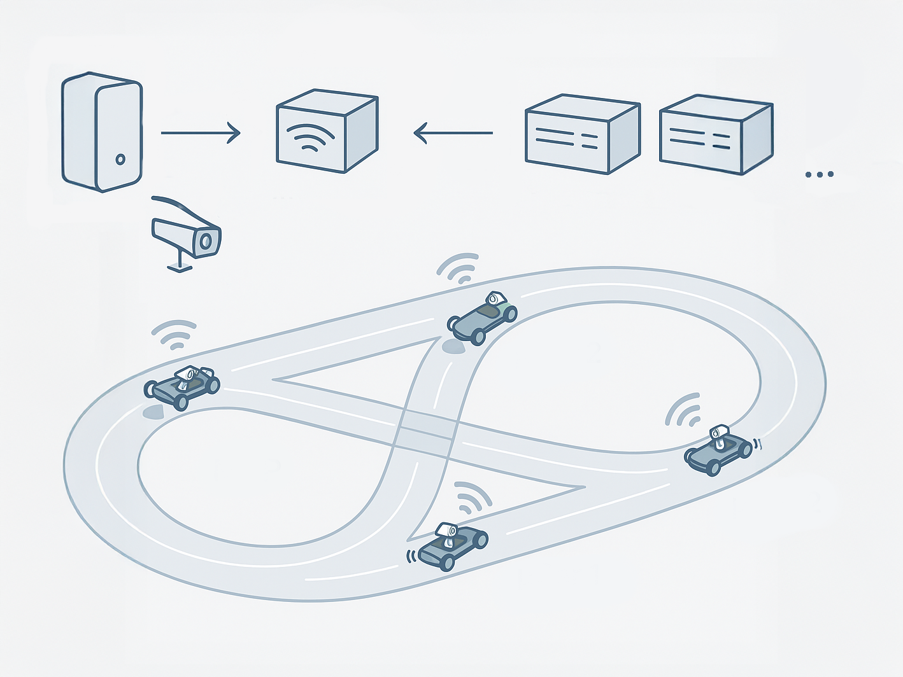

.. _index:

Welcome to the CPM Lab's documentation!
==================================================================================

.. toctree::
   :maxdepth: 2
   :hidden:
   :caption: Contents
   
   installation/installation
   experiment/experiment
   trouble_shooting_guide
   literature

.. important::

   This documentation serves as supplementary material for our :ref:`Zero-Shot MARL Benchmark in the Cyber-Physical Mobility Lab <beerwerth2026zeroshot>` paper and does not represent the full scope of the CPM Lab documentation. We are currently developing a new version of the CPM Lab. Once it is ready, we will release the complete documentation here.

In this documentation, you'll find comprehensive information about the Cyber-Physical Mobility Lab (CPM Lab).

The original CPM Lab was established at RWTH Aachen University in 2017 and later relocated to the University of the Bundeswehr Munich in 2024. Today, there are multiple versions of the CPM Lab located across various locations, including Germany, Egypt, the United States, and India.

Each lab has a slightly different setup, but they all share the common objective of providing a platform for research and development in the field of connected and automated vehicles.

Since each lab has its unique setup, this documentation presents the CPM Lab as a collection of components that can be combined and customized to suit your specific needs.

As depicted in the accompanying image, the lab comprises a central workstation that offers access to the infrastructure. This workstation processes information from the indoor positioning system and the control center. You can execute your motion planner, which sends commands to the vehicles using ROS2. This system operates similarly to a cloud system by disseminating all information to all network members, including cars and external computational units.

Your motion planner communicates with the CPM Lab through a synchronization layer known as the bridge, which is responsible for synchronizing data between the various components of the lab.

If you use the CPM Lab in your work, please see :doc:`Literature <literature>` to cite the CPM Lab.

Getting started
---------------

.. important::

   This documentation is a work in progress. Some sections may be incomplete or missing. We appreciate your understanding as we continue to enhance the documentation. If you have any questions or need assistance, please feel free to reach out to us in our `Slack community <https://join.slack.com/t/small-scaletestbeds/shared_invite/zt-2z25i95om-Xa4Yg1sDoWexjpVTefszBA>`_ or via `email <mailto:cas@unibw.de>`_. The original documentation for the CPM Lab 1.0 can be found in the :download:`PDF export </assets/cpm_lab_1_0_documentation.pdf>` of the now obsolete confluence documentation.

* :doc:`Installation <installation/installation>` Set up the CPM Lab with ease! Follow these step-by-step instructions to get your environment up and running for the first time.

* :doc:`Experiment <experiment/experiment>` Dive into the world of simulations and experiments with the CPM Lab. Learn how to set up and run various scenarios to test your motion planners and vehicle behaviors.

Acknowledgement
---------------

We acknowledge the financial support for this project by the `Collaborative Research Center / Transregio 339 <https://www.sfbtrr339.de/de/>`_ of the German Research Foundation (DFG).

.. |date| date::

Website last updated on |date|.
